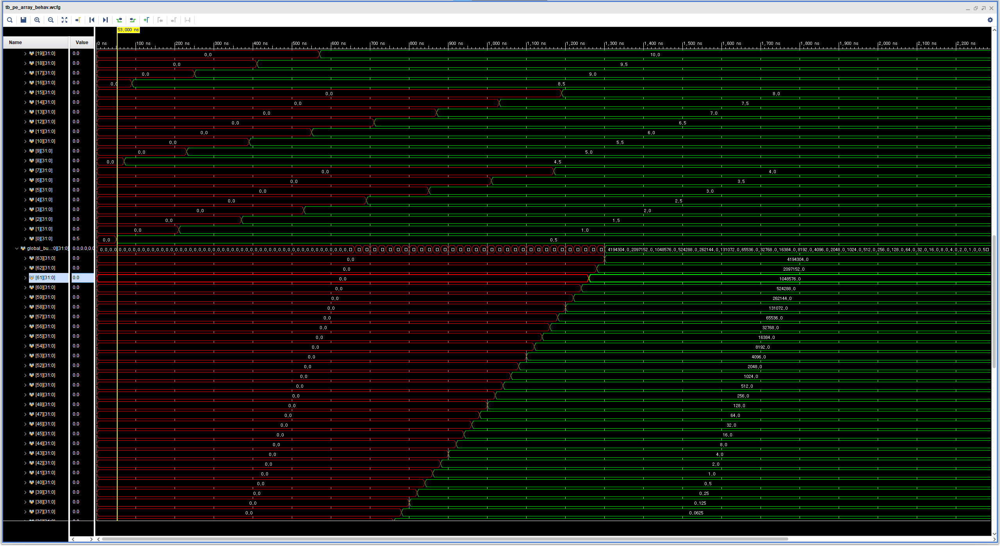

# HSD Final Project
[Team 28] 2014-17831 김재원

- [V0 (Hardware)](#v0-hardware)
  - [Design](#design)
      - [V0 (Baseline) Design](#v0-baseline-design)
      - [V0 (Optimized) Design](#v0-optimized-design)
  - [Implementation](#implementation)
  - [Simulation](#simulation)
      - [V0 (Baseline) Simulation](#v0-baseline-simulation)
      - [V0 (Optimized) Simulation](#v0-optimized-simulation)
- [V0 (Software)](#v0-software)
- [V1 (DMA)](#v1-dma)

## V0 (Hardware)
### Design
V0는 Lab 06에서 구현한 PE controller와 final project 스펙에 안내된 5개 state를 그대로 반영한 baseline 버전 (`pe_array.v`), 그리고 load-calc-harv의 세 개 state를 pipeline한 optimized 버전 (`pe_array_op.v`)으로 나누어서 구현하였습니다.

#### V0 (Baseline) Design
##### PEs
- Baseline 버전의 경우 Lab 06과 구현이 거의 동일합니다. 차이가 있다면, PE가 64개이기 때문에 해당 부분을 `generate` statement로 아래와 같이 구현을 하였습니다.  
- `valid`와 `dvalid` 신호가 하나의 wire로 연결되어있기 때문에 모든 PE가 동시에 input을 받아 동시에 계산을 마칩니다.
- Lab 06 채점 공지에서 안내된 바와 같이 done signal이 유지되는 동안 연산값은 레지스터 `res`에 유지가 됩니다.
```V
genvar i;
generate 
    for (i = 0; i < NUM_PE; i = i+1) begin: MY_PE_ARRAY
        my_pe MY_PE (
            .aclk(aclk),
            .aresetn(aresetn && next_state != S_IDLE),  // reset when new matrix comes in
            .ain(ain[i]),
            .bin(bin[i]),
            .valid(valid),
            .dvalid(dvalid),
            .dout(dout[i])
        );
    end
endgenerate
```

##### HARV State
- Lab 06와 V0 Baseline 간의 또 하나의 차이는 V0에서만 HARV state가 있다는 점입니다. 
- 모든 PE가 동시에 계산을 완료하기 때문에 단순히 `counter_harv`라는 up counter을 두어 0부터 63까지 세도록 하고, 해당 counter의 값을 주소로 삼아 차례로 `BRAM_WRDATA`로 연산한 결과를 보냈습니다.
```V
always @(posedge aclk)
    if(rst_harv)
        counter_harv <= 0;
    else
        counter_harv <= counter_harv + 1;

// ...

always @(*)
    case(present_state)
        S_HARV: rst_harv = 0;
        S_DONE: rst_harv = 0;
        default: rst_harv = 1;  // counter for S_HARV continues to tick
    endcase

// ...

assign BRAM_WE = (present_state == S_HARV) ? 4'b1111 : 4'b0;
assign BRAM_WRDATA = (BRAM_WE) ? res[counter_harv]: 0;
```

#### V0 (Optimized) Design
- Optimized 버전의 경우 LOAD-CALC-HARV state를 병합하여 COMP state를 만들어 구현하였습니다.
  - LOAD를 다 기다렸다가 CALC를 하게 될 경우 너무 오래 걸리고, HARV 또한 조금은 미리 시작할 수 있다는 점을 고려해서 LOAD가 완료되기 전에 연산을 진행할 수 있는 PE는 바로 연산을 진행하고, HARV 또한 연산 결과가 도출된 PE는 바로 내보내는 방식입니다.
- LOAD를 어떻게 해야 CALC가 최대한 빨리 끝날 수 있을지에 대해서는 많이 고민을 해봤는데, CALC가 16 cycle이 걸린다는 점에서, 연산을 완료한 첫 PE가 빨리 나오는 것보다는 최대한 많은 연산을 미리 하는 것이 유리하다는 결론을 내리게 되었습니다.
  - 이에 Week 7 Lecture에서 안내되었던 바와 같이, 대각선에 있는 PE들을 PE controller로 삼아서 나머지 PE들에 broadcasting을 해주는 방식을 택하여 구현하였습니다.
  - 다음 그림과 같은 3x3 matrix를 가정하였을 때, pipelining된 실행 과정은 아래 표와 같습니다.  


| Cycle | LOAD | CALC | HARV |
| ----- | ---- | ---- | ---- |
| 1 | 10 | - | - | 
| 2 | 1 | PE1(1,10) |
| 3 | 11 | PE2(1,11) | - |
| 4 | 4 | PE4(4,10), PE5(4,11) | - |
| 5 | 12 | PE6(4,12), PE3(1,12) | - |
| 6 | 7 | PE7(7,10), PE8(7,11), PE9(7,12) | - |
| 7 | 13 | - | - |
| 8 | 2 | PE1(2,13) | - |
| 9 | 14 | PE2(2,14) | - |
| 10 | 5 | PE4(5,13), PE5(5,14) | - |
| 11 | 15 | PE6(5,15), PE3(2,15) | - |
| 12 | 8 | PE7(8,13), PE8(8,14), PE9(8,15) | - |
| 13 | 16 | - | - |
| 14 | 3 | PE1(3,16) | PE1 |
| 15 | 17 | PE2(3,17) | PE2 |
| 16 | 6 | PE4(6,16), PE5(6,17) | PE4, PE5 |
| 17 | 18 | PE6(6,18), PE3(3,18) | PE3, PE6 |
| 18 | 9 | PE7(9,16), PE8(9,17), PE9(9,18) | PE7, PE8, PE9 |
- 구현 당시 `BRAM_ADDR`로 `BRAM_WRDATA`가 저장될 주소를 지정해줄 수 있다는 사실을 모르고 HARV가 순서대로 일어나야 하는 것으로 착각을 했습니다. 
  - 이 잘못된 가정을 전제하였을 때, 위 표를 보면 HARV stage에서 PE3의 연산 결과가 차례대로 harvest를 하는 과정의 병목이 된다고 판단을 하였습니다.
  - 따라서 PE3의 연산이 최대한 빨리 일어날 수 있도록 대각선상의 weight-input data pair을 load할 시, input matrix로부터 먼저 가져올 수 있도록 - 즉, 홀수번째 clock cycle에 input matrix data가 들어오고 짝수번째 clock cycle에 weight matrix의 data가 들어오도록 - 구현을 하였습니다.
  (8x8 matrix를 사용하는 이번 프로젝트에서는 PE3이 PE8, 즉 여덟번째 PE에 해당될 것입니다.)

[Back to Top](#hsd-final-project)

### Implementation
- Baseline 버전의 경우 설명할 부분이 많지 않아 optimized 버전에 대한 구현만 설명하도록 하겠습니다.
- 다음은 optimized pe array 코드인 `pe_array_op.v` 코드의 일부입니다.

#### Clock
```V
wire aclk = S_AXI_ACLK;
wire aclk_180;
wire aresetn = S_AXI_ARESETN;
assign BRAM_CLK = aclk_180; 

// bram clock
clk_wiz_0 u_clk (.clk_out1(aclk_180), .clk_in1(aclk));
```
- 이후 실습자료 [additional material 1]의 슬라이드 4를 통해 `myip_v1_0_S00_AXI.v` 파일에서 `BRAM_CLK`과 `S_AXI_ACLK`을 연결해주는 방법을 확인하였지만, 구현 당시에는 이 방법을 잘 몰라서 PE array 구현에 해당 코드를 추가하였습니다.
- 처음 구현했을 때는 AXI에서 사용하는 대문자 명칭들을 사용하지 않고 `wrdata`, `rddata`와 같은 변수명들을 사용하였는데, 구현을 하면서 헷갈리는 부분들이 생겨 대문자 명칭으로 통일하였습니다.
  - 다만 `S_AXI_ACLK`의 경우에만 특별히 사용되는 부분이 많아 `aclk`으로의 wire를 별도로 선언하였습니다.

#### Counters
```V
always @(posedge aclk) begin
    counter_load <= rst_load ? 0 : !load_done ? counter_load + 1 : counter_load;
    counter_calc <= rst_calc ? 0 : !calc_done && valid[NUM_PE-1] ? counter_calc + 1 : counter_calc;
    counter_harv <= rst_harv ? -8 : !harv_done ? counter_harv + 1 : counter_harv;
    counter_done <= rst_done ? 0 : !done_done ? counter_done + 1 : counter_done;
end
```
- CALC의 경우 대각선에 있는 PE들이 총 여덟 번 연산을 해야하기 때문에 `counter_calc` 또한 8번 increment가 됩니다. 즉, `counter_calc`는 총 8개 stage 중 몇 번째 multiplication stage에 있는지를 나타내줍니다.
  - 따라서 마지막 PE에 valid 신호가 들어가게 되었을 때 `counter_calc` 값이 increment가 되어 다음 stage로 넘어가게 됩니다.
- `counter_harv`의 값으로 `BRAM_WRDATA`에 내보낼 값과 해당 값을 저장할 위치인 `BRAM_ADDR` 또한 지정합니다. 이 때 `counter_harv`가 -8부터 시작하는 것은 앞서 언급한 바와 같이 PE8의 연산이 완료 되자마자 harvest가 될 수 있도록 해당 PE가 연산을 마칠 시점을 지정해주기 위함입니다. 즉, `counter_harv` 값으로 인한 harvesting이 false하게 먼저 일어나도록 해주는 장치입니다.

#### States
```V       
// part 2: determine next state
always @(*)
    case(present_state)
        S_IDLE: next_state <= (start) ? S_COMP : present_state;
        S_COMP: next_state <= (harv_done) ? S_DONE : present_state;
        S_DONE: next_state <= (done_done) ? S_IDLE : present_state;
        default: next_state <= S_IDLE;
    endcase
```
- 본 구현 방식에서는 LOAD-CALC-HARV stage를 병합한 S_COMP stage가 존재합니다.
- 각 stage의 output은 일반적인 방식으로 구현하였습니다.

#### Address
```V     
reg [31:0] addr;
assign BRAM_ADDR = (BRAM_WE) ? (counter_harv) << 2 : ((counter_load & 1'b1) ? (counter_load >> 4) + (V_SIZE * ((counter_load & 4'b1111) >> 1)) : (NUM_PE + (counter_load >> 1))) << 2;
always @(posedge aclk)
    addr <= (BRAM_ADDR) >> 2;

always @(posedge aclk)
    if (counter_load > 0 && counter_load <= 128) begin
        if (addr < NUM_PE) 
            global_buffer1[addr] = BRAM_RDDATA;
        else
            global_buffer2[addr - NUM_PE] = BRAM_RDDATA;
    end
```
- `BRAM_ADDR`이 사용되는 경우는 load와 harv이 될 때인데, HARV state에 있는지 여부는 `BRAM_WE`이 0인지 아닌지에 따라 판단할 수 있습니다. HARV state에 있을 때에는 `BRAM_WE`이 `4'b1111`이 되기 때문입니다.
  - 우선 PE array가 HARV state에 있을 때에는 `counter_harv`의 값에 따라 `BRAM_ADDR`가 결정이 됩니다.
  - LOAD state의 경우 조금 더 복잡합니다. Optimized 버전의 경우 대각선 PE에 필요한 data를 순서대로 load해오기 때문에, baseline 버전과 달리 `global_buffer`에 load되는 matrix index의 순서가 `counter_load`의 값에 의해 결정되지 않습니다.
    - 일단 `counter_load`가 0부터 시작한다고 가정했을 때, 해당 값이 짝수일 때는 input matrix에서 load를 하고 홀수일 때는 weight matrix에서 load를 하기 때문에 `(counter_load & 1'b1)` 조건으로 분리를 합니다.
    - 3x3을 가정을 했을 때, `counter_load`가 짝수일 경우 input matrix로부터 10, 11, 12, 13, 14, ...번째 값의 순서로, 즉 차례대로 load가 됩니다. 따라서 `counter_load` 값을 2로 나눈 뒤 weight matrix 크기 만큼 offset을 주고 해당 값을 두 번 left shift하여 만든 값, 즉 `(NUM_PE + (counter_load >> 1))) << 2`이 read address가 됩니다.
    - 마찬가지로 3x3 matrix를 가정했을 때, `counter_load`가 홀수일 경우 0, 3, 6 / 1, 4, 7 / 2, 5, 8번째 index의 순서대로 load가 된다. 즉, 0부터 시작해서 `V_SIZE` 만큼의 stride로 `V_SIZE`의 횟수만큼 load를 하되, 그걸 각 열에 대해 반복하는 것입니다. 이 때, 대각선 PE 8개에 load를 하기 위해서는 총 16개의 데이터를 load하게 되므로 `counter_load`가 16번 increment될 때마다 새로운 열의 데이터를 가져오게 됩니다. 따라서 첫 데이터의 index는 `(counter_load >> 4)`, 즉 `counter_load`를 16으로 나눈 값, 즉 대각선 PE에 총 몇 회째 데이터를 가져오고 있는지에 대한 정보, 혹은 몇 번째 열에서 가져오고 있는지에 대한 정보를 담습니다. 그리고 `V_SIZE` 만큼의 stride로 index를 increment하는 cycle이 반복되므로 한 cycle 내에서 몇 번째 load를 하고 있는 것인지를 `(counter_load & 4'b1111)`로 파악한 후 해당 값을 2로 나눠 짝수번째 load를 걸러주고 해당 값에 `V_SIZE`를 곱하여 `(V_SIZE * ((counter_load & 4'b1111) >> 1))`, 즉 열의 첫 index로부터의 offset을 알아냅니다. 첫 열의 index와 그로부터의 offset을 더한 값, `(counter_load >> 4) + (V_SIZE * ((counter_load & 4'b1111) >> 1))`이 홀수번째 index가 됩니다. 해당 값을 두 번 left shift해 4를 곱해주면 홀수번째 load의 read address가 됩니다.
- read를 한 후 저장할 때 load가 global_buffer을 기준으로 순서대로 되는 것이 아니기 때문에 어떤 index에 해당하는 값을 읽어왔는지, 그 address 정보를 가지고 있어야 합니다. 따라서 레지스터 `addr`를 선언하여 `BRAM_ADDR`를 right shift 두 번 하여 index로 변환한 저장해주고, 해당 값을 index로 삼아 읽어온 `BRAM_RDDATA` 값을 `global_buffer1`과 `global_buffer2`에 적절히 저장해줍니다.
     
#### Passing Values
```
// Operations for S_CALC
genvar m, n;
for (m = 0; m < V_SIZE; m = m+1) begin
    for (n = 0; n < V_SIZE; n = n+1) begin
        assign ain[m * V_SIZE + n] = global_buffer1[m * V_SIZE + counter_calc];
        assign bin[m * V_SIZE + n] = global_buffer2[n + counter_calc * V_SIZE];
    end
end
```
- V0 Baseline과 동일한 구현인데, weight matrix와 input matrix로부터 읽어오는 index를 고려하여 `ain`과 `bin`에 값을 상시  assign해줍니다. 
  - 실제로 PE에서 값을 읽는 시점은 `valid` bit으로 조절을 해주기 때문에 상시 assign을 하여도 무방합니다.
  - `counter_calc`는 대각선 PE에 몇 번째 load를 하고 있는 것인지, 그 multiplication cycle을 나타내주기 때문에 해당 값을 이용하여 직관적으로 구현하였습니다.
    
#### Valid Signals
```
// valid_en
genvar x;
wire valid_en [NUM_PE-1:0];
assign valid_en[0] = (counter_load == 2) || (counter_load > 2 && counter_calc < 8 && dvalid[0]);
assign valid_en[1] = (counter_load == 3) || (counter_calc > 0 && counter_calc < 8 && dvalid[1]);
assign valid_en[8] = (counter_load == 4) || (counter_calc > 0 && counter_calc < 8 && dvalid[8]);
assign valid_en[9] = (counter_load == 4) || (counter_calc > 0 && counter_calc < 8 && dvalid[9]);
assign valid_en[2] = (counter_load == 5) || (counter_calc > 0 && counter_calc < 8 && dvalid[2]);
assign valid_en[10] = (counter_load == 5) || (counter_calc > 0 && counter_calc < 8 && dvalid[10]);
for (x = 16; x <= 18; x = x+1) begin
    assign valid_en[x] = (counter_load == 6) || (counter_calc > 0 && counter_calc < 8 && dvalid[x]);
end
for (x = 3; x <= 19; x = x+8) begin
    assign valid_en[x] = (counter_load == 7) || (counter_calc > 0 && counter_calc < 8 && dvalid[x]);
end    
for (x = 24; x <= 27; x = x+1) begin
    assign valid_en[x] = (counter_load == 8) || (counter_calc > 0 && counter_calc < 8 && dvalid[x]);
end
for (x = 4; x <= 28; x = x+8) begin
    assign valid_en[x] = (counter_load == 9) || (counter_calc > 0 && counter_calc < 8 && dvalid[x]);
end      
for (x = 32; x <= 36; x = x+1) begin
    assign valid_en[x] = (counter_load == 10) || (counter_calc > 0 && counter_calc < 8 && dvalid[x]);
end
for (x = 5; x <= 37; x = x+8) begin
    assign valid_en[x] = (counter_load == 11) || (counter_calc > 0 && counter_calc < 8 && dvalid[x]);
end      
for (x = 40; x <= 45; x = x+1) begin
    assign valid_en[x] = (counter_load == 12) || (counter_calc > 0 && counter_calc < 8 && dvalid[x]);
end
for (x = 6; x <= 46; x = x+8) begin
    assign valid_en[x] = (counter_load == 13) || (counter_calc > 0 && counter_calc < 8 && dvalid[x]);
end   
for (x = 48; x <= 54; x = x+1) begin
    assign valid_en[x] = (counter_load == 14) || (counter_calc > 0 && counter_calc < 8 && dvalid[x]);
end
for (x = 7; x <= 55; x = x+8) begin
    assign valid_en[x] = (counter_load == 15) || (counter_calc > 0 && counter_calc < 8 && dvalid[x]);
end      
for (x = 56; x <= 63; x = x+1) begin
    assign valid_en[x] = (counter_load == 16) || (counter_calc > 0 && counter_calc < 8 && dvalid[x]);
end

// valid signal
integer k;
always @(posedge aclk)
    for (k = 0; k < NUM_PE; k = k+1) begin
        valid[k] <= valid_en[k] && !valid[k] ? 1'b1 : 1'b0;
    end
```
- 앞서 작성한 [표](#v0-optimized-design)에 나타나있듯, `counter_load`, 즉 clock cycle에 따라 calculation을 할 수 있는 PE들이 다릅니다. 적절한 값이 load되어 계산을 할 수 있게 되는 즉시 `valid_en`, 즉 `valid`를 1로 만들어 연산을 시작하도록 하고자 했기 때문에, 위와 같이 구현을 하였습니다. (일반화된 방법을 찾지 못해 0~63번 PE 중 어떤 PE가 valid이 되어야 하는지를 거의 하드코딩하였습니다.)
- 보다 구체적으로는, `assign valid_en[0] = (counter_load == 2) || (counter_load > 2 && counter_calc < 8 && dvalid[0]);`을 예시로 들었을 때, `||` 앞에 있는 부분은 `(counter_load == 2)`가 첫 번째 multiplication cycle에 - 즉 `counter_calc`가 0일 때, 혹은 대각선 PE에 처음으로 load를 하는 시점에 - `counter_load` 값에 따라 몇 번째 PE들이 활성화되어야 하는지를 지정해준 것입니다. (PE의 번호는 `valid_en[x]`의 `x` 값으로 지정이 됩니다.)
- `||` 뒤의 부분, 즉 `(counter_calc > 0 && counter_calc < 8 && dvalid[x]);`와 같은 부분은, 직전에 언급한 첫번째 multiplication cycle에서의 동작 이후 17 cycle씩 지나 다시 `valid_en`이 1이 되어야 하는 경우들을 지정해준 것인데, `counter_calc`, 즉 multiplication/CALC cycle이 1~7인 동안 해당되는 `dvalid` 신호가 1이 된 직후에 다시 1이 되도록 한 것입니다. 
  - 이 때 PE 0번에 한해서만 `(counter_load > 2 && counter_calc < 8 && dvalid[0]);`, 즉 두 번째 multiplication cycle에 대해 `counter_calc > 0`가 아닌 `counter_load > 2`로 구분을 하는데, 이는 `counter_calc` 값이 `counter_load`와 PE 0번의 `valid` 신호에 의해 지정되기 때문입니다.

#### Writing Output Values
```
// Operations for S_HARV
assign BRAM_WE = ((counter_harv < 64) && (present_state == S_COMP)) ? 4'b1111 : 4'b0000;
assign BRAM_WRDATA = (present_state == S_COMP) ? res[counter_harv]: 0;
```
- `BRAM_WE`이나 `BRAM_WRDATA`는 `counter_harv`에 의해 간단하게 결정이 됩니다. LOAD나 CALC와 달리 matrix의 index에 따라 순차적으로 진행이 되도록 구현했기 때문에 간단히 구현할 수 있었습니다.

#### AXI Bus Interface
- AXI Bus와의 연결은 실습 자료 Lab 10 슬라이드 29에 있는 코드를 그대로 활용하였습니다. 
  - `5555` 신호와 `start`, `done`, 등이 어떻게 활용이 되어 PE array에 전달되는지는 이해하였습니다. 

[Back to Top](#hsd-final-project)

### Simulation
- PE array를 테스트하기 위한 testbench 파일 `tb_pe_array.v`를 만들어 다양한 floating point 값을 넣어보고, 해당 matrix들 간의 곱셈을 `mac.ipynb` 파일로 계산하여 PE array의 작동을 확인하였습니다.
```V
module tb_pe_array();
    reg aclk;
    reg aresetn;
    reg start;
    reg [31:0] rddata;
    wire [31:0] wrdata;
    wire [31:0] rdaddr;
    wire done;
    wire [3:0] we;
    wire bram_clk;

    reg [31:0] mem [0:8191]; // 128 of 32 bit data
    
    integer i;
    
    initial begin
        aclk <= 1;
        aresetn <= 0;
        start <= 0;
                
        // weight matrix
        mem[0*4] <= 'h3f000000;
        mem[1*4] <= 'h3f800000;
        mem[2*4] <= 'h3fc00000;
        mem[3*4] <= 'h40000000;
        // ...
        mem[60*4] <= 'h41f40000;
        mem[61*4] <= 'h41f80000;
        mem[62*4] <= 'h41fc0000;
        mem[63*4] <= 'h42000000;
        

        // input matrix
        mem[64*4] <= 'hc2000000;
        mem[65*4] <= 'hc1f00000;
        mem[66*4] <= 'hc1e00000;
        mem[67*4] <= 'hc1d00000;
        // ...
        mem[124*4] <= 'h49000000;
        mem[125*4] <= 'h49800000;
        mem[126*4] <= 'h4a000000;
        mem[127*4] <= 'h4a800000;
        
        #10;
        aresetn <= 1;
        start <= 1; 
    end
    
    always @(posedge aclk)
        rddata <= mem[rdaddr];
    
//    pe_array_v1 MY_PE_ARRAY (     // baseline
    pe_array_v2 MY_PE_ARRAY (       // optimized
        .S_AXI_ACLK(aclk),
        .S_AXI_ARESETN(aresetn),
        .start(start),
        .BRAM_RDDATA(rddata),
        .BRAM_WRDATA(wrdata),
        .BRAM_ADDR(rdaddr),
        .done(done),
        .BRAM_WE(we),
        .BRAM_CLK(bram_clk)
    );
    
    always #5 aclk = ~aclk;
endmodule
```
- 각 matrix에 저장한 값과 그 matrix간의 곱셈 연산 결과는 다음과 같습니다:

###### 예상 결과

- PE1에는 `1.314765e+05`, PE2에는 `2.63002010e+05`, ... PE64에는 (1.34735012e+08)의 값이 담겨야 합니다.

#### V0 (Baseline) Simulation
Baseline 버전의 simulation 결과는 다음과 같습니다:

- 3340ns에 done signal이 처음으로 올라옵니다.


- [예상된 연산값](#예상-결과)이 `BRAM_WRDATA`에 잘 담기고 `global_buffer`에도 적절한 값들이 담기는 것을 확인할 수 있습니다.

#### V0 (Optimized) Simulation
Optimized (pipelined) 버전의 simulation 결과는 다음과 같습니다:

- 2110ns에 done signal이 처음으로 올라옵니다. Baseline 버전에 비해 약 30~40% 가량 빨라진 것을 알 수 있습니다.

- 위 [Design](#design)에서 작성한 바와 같이 대각선 위치에 있는 PE들에 차례로 값을 제공하는 방식으로 global buffer로의 load가 잘 이루어지고 있음을 확인할 수 있습니다.

- 필요한 값이 load되는 즉시 첫 번째 PE의 valid 신호가 1이 되며 CALC가 시작됨을 확인할 수 있습니다.

- PE7의 경우 결과 matrix의 첫 번째 행의 마지막 PE로, 해당 PE는 연산이 완료되는 즉시 harvest가 되도록 구현하였고, 해당 구현이 잘 이루어졌음을 위 스크린샷을 통해 확인할 수 있습니다.

[Back to Top](#hsd-final-project)

## V0 (Software)
- 위에서 구현한 optimized 버전의 `benchmark.sh`를 실행한 결과는 다음과 같습니다:

Explain SW/HW System that you implemented.
 It is sufficient to include only project-specific contents.
 You must include the results and analysis of your work
- inference time, total_image, accuracy, etc.

[Back to Top](#hsd-final-project)

## V1 (DMA)
